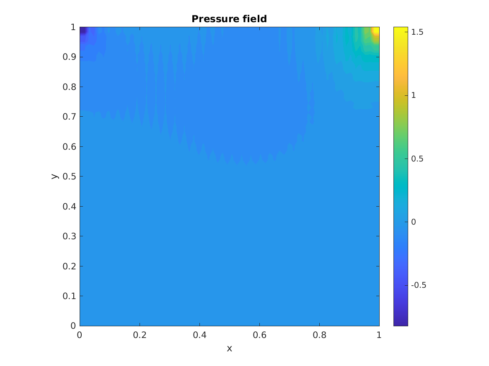
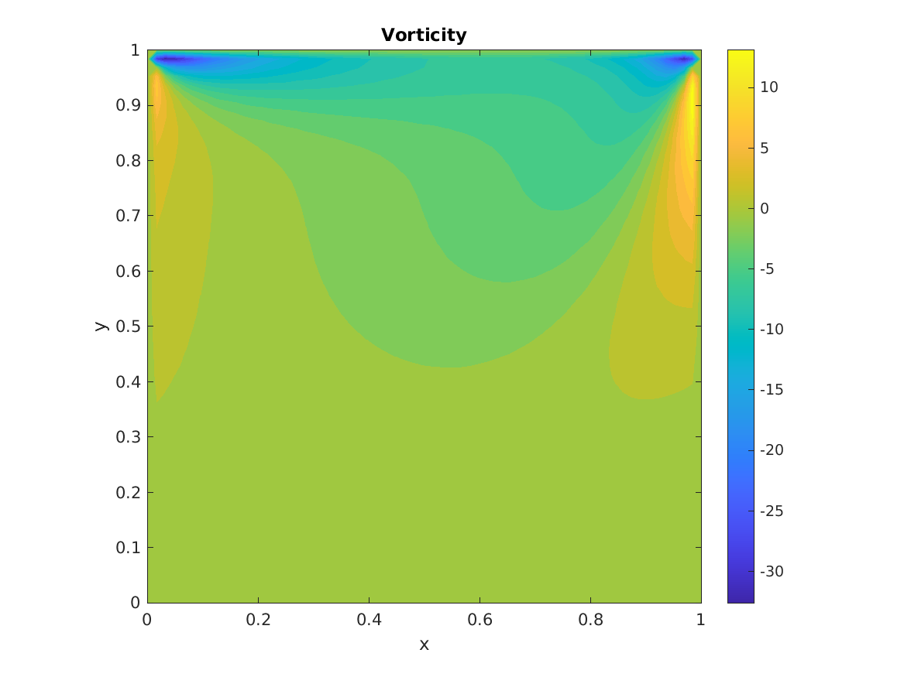
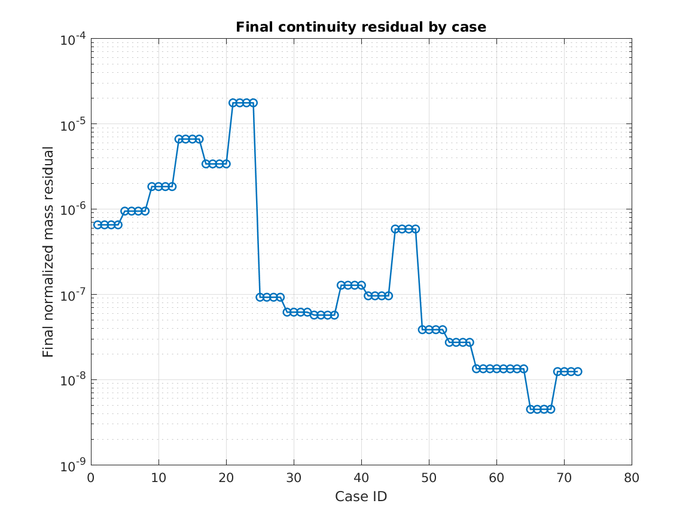

# Lid-Driven Cavity CFD Solver in MATLAB

[](https://www.mathworks.com/products/matlab.html)
[](LICENSE)
[](#)
[](#)

A MATLAB CFD benchmark project for the **2D incompressible lid-driven cavity** problem using a SIMPLE-style pressure-correction solver.

The project focuses on learning and documenting CFD from the numerical-method level: discretization, pressure-velocity coupling, residual monitoring, pressure-solver behavior, mesh sensitivity, scheme comparison, and validation against benchmark data.

<p align="center">
  
</p>

---

## Why this project matters

The lid-driven cavity is a classical CFD benchmark because it looks simple but tests several important parts of an incompressible-flow solver:

- pressure-velocity coupling,
- no-slip wall boundary conditions,
- vortex formation,
- Reynolds-number dependence,
- mesh sensitivity,
- numerical diffusion versus stability,
- validation using centerline velocity profiles.

This repository is intended as a clean portfolio-style CFD project rather than only a collection of MATLAB scripts.

---

## Highlights

| Category | Implementation |
|---|---|
| Problem | 2D incompressible lid-driven cavity |
| Method | SIMPLE-style pressure correction |
| Grid | Structured Cartesian collocated grid |
| Momentum predictor | Loop-based and vectorized MATLAB versions |
| Convection schemes | Upwind and central differencing |
| Pressure solvers | Red-Black Gauss-Seidel and Red-Black SOR |
| Study size | 72 cases |
| Meshes | `N = 32, 64, 128` |
| Reynolds numbers | `Re = 100, 400, 1000` |
| Validation | Ghia et al. centerline benchmark data |
| Toolboxes | Base MATLAB only for the included solver and plotting scripts |

---

## Numerical model

The solver uses the non-dimensional incompressible Navier-Stokes equations:

```math
\nabla \cdot \mathbf{u} = 0
```

```math
\frac{\partial \mathbf{u}}{\partial t}
+
(\mathbf{u}\cdot\nabla)\mathbf{u}
=
-\nabla p
+
\frac{1}{Re}\nabla^2 \mathbf{u}
```

where `u` and `v` are the velocity components, `p` is pressure, and `Re` is the Reynolds number.

The top lid moves with a non-dimensional velocity of `U_lid = 1`. The other walls are stationary no-slip boundaries.

---

## Solver workflow

For each case, the solver performs the following process:

1. initialize velocity and pressure,
2. apply lid-driven cavity boundary conditions,
3. predict intermediate velocity from the momentum equations,
4. compute the divergence of the predicted velocity,
5. solve the pressure-correction Poisson equation,
6. correct the velocity field,
7. update pressure using under-relaxation,
8. compute velocity and mass residuals,
9. repeat until the convergence criteria or maximum iteration limit is reached.

The project stores both a normalized finite-volume-style mass residual and a raw divergence diagnostic. This makes the convergence history easier to interpret across different mesh sizes.

---

## Study matrix

The full study consists of:

```text
3 meshes × 3 Reynolds numbers × 2 schemes × 2 pressure solvers × 2 implementations = 72 simulations
```

| Parameter | Values |
|---|---|
| Mesh size | `32`, `64`, `128` |
| Reynolds number | `100`, `400`, `1000` |
| Convection scheme | `upwind`, `central` |
| Pressure solver | `RBGS`, `RBSOR` |
| Implementation | `loop`, `vectorized` |

---

## Representative results

The selected figures below are included in `assets/figures/` so the repository remains lightweight while still showing the output quality.

### Velocity magnitude


### Streamlines


### Residual history


### Pressure field



### Vorticity field



---

## Validation against Ghia et al.

The solver is compared with the classical centerline benchmark data from Ghia, Ghia, and Shin for:

- `u(y)` along the vertical centerline at `x = 0.5`,
- `v(x)` along the horizontal centerline at `y = 0.5`.

Validation data is included for `Re = 100`, `Re = 400`, and `Re = 1000`.

### Example centerline validation


---

## Study-level comparison plots

### Runtime comparison


### Pressure-solver iteration comparison


### Validation error comparison


### Final mass residual comparison



---

## Main observations from the study

Based on the generated summary data in `assets/data/study_summary.csv`:

- The project ran the full 72-case study.
- 44 cases passed the selected Ghia validation thresholds.
- The remaining cases are kept in the summary because they are useful for understanding under-resolution, numerical diffusion, and solver limitations.
- RBSOR reduced pressure-solver cost significantly compared with RBGS in the tested cases.
- Central differencing gave better benchmark agreement when the mesh was sufficiently resolved.
- Upwind differencing was more robust but more diffusive, especially on coarse grids.
- Higher Reynolds-number cases require stronger mesh resolution to capture the velocity profiles accurately.

Many cases reached the configured maximum outer iteration limit. For that reason, the repository uses honest labels such as `validated_but_not_converged` instead of claiming that every case is fully converged.

---

## Repository structure

```text
LidCavity_MATLAB/
├── README.md
├── LICENSE
├── CITATION.cff
├── .gitignore
├── .gitattributes
│
├── main.m                 # Full 72-case study
├── main_medium.m          # Intermediate study
├── main_quick.m           # Smaller quick test study
├── default_config.m       # Central configuration
│
├── core/                  # Solver, pressure correction, residuals, boundary conditions
├── studies/               # Case runners and study automation
├── validation/            # Ghia benchmark data and validation functions
├── post/                  # Plotting and result export
├── docs/                  # Methodology and project documentation
├── assets/                # Selected GitHub figures and summary data
└── results/               # Generated output folders; contents ignored by Git
```

More details are available in [`docs/REPOSITORY_STRUCTURE.md`](docs/REPOSITORY_STRUCTURE.md).

---

## How to run

### Option 1: Quick run

Use this first after cloning the repository.

```bash
chmod +x run_quick.sh
./run_quick.sh
```

or inside MATLAB:

```matlab
main_quick
```

### Option 2: Medium run

```bash
chmod +x run_medium.sh
./run_medium.sh
```

or inside MATLAB:

```matlab
main_medium
```

### Option 3: Full study

```bash
chmod +x run.sh
./run.sh
```

or inside MATLAB:

```matlab
main
```

The full study may take a long time because it runs 72 cases and includes fine-grid simulations.

---

## Output folders

Generated output is written to:

```text
results/data/
results/figures/
```

Typical generated files include:

- `study_summary.csv`,
- residual plots,
- velocity magnitude plots,
- pressure contours,
- streamline plots,
- vorticity plots,
- Ghia validation plots,
- study-level comparison plots.

The generated `results/` contents are ignored by Git to keep the repository clean. Selected figures for the README are stored under `assets/figures/`.

---

## Summary table columns

The generated study summary includes columns such as:

| Column | Meaning |
|---|---|
| `Implementation` | Loop or vectorized solver |
| `N` | Mesh resolution |
| `Re` | Reynolds number |
| `Scheme` | Upwind or central differencing |
| `PressureSolver` | RBGS or RBSOR |
| `Status` | Solver stopping status |
| `Quality` | Human-readable quality label |
| `FinalRu`, `FinalRv` | Final velocity residuals |
| `FinalRcMass` | Normalized mass residual |
| `FinalRcDiv` | Raw divergence diagnostic |
| `Runtime_s` | Runtime in seconds |
| `AvgPoissonIterations` | Average pressure iterations per outer iteration |
| `PressureSaturationRatio` | Fraction of pressure solves reaching the pressure-iteration limit |
| `Ghia_u_L2`, `Ghia_v_L2` | Centerline L2 validation errors |
| `ValidationPass` | Whether the case passed the selected benchmark tolerance |

---

## Known limitations

This is an educational and portfolio-style MATLAB CFD solver. Current limitations include:

- collocated finite-difference formulation,
- no Rhie-Chow interpolation,
- no turbulence model,
- no adaptive mesh refinement,
- no multigrid pressure solver,
- high-Reynolds-number cases are sensitive to mesh resolution,
- the implementation prioritizes clarity and comparison over maximum performance.

These limitations are intentionally documented because they are part of the numerical learning process.

---

## Documentation

| Document | Purpose |
|---|---|
| [`docs/WHAT_THIS_PROJECT_DOES.md`](docs/WHAT_THIS_PROJECT_DOES.md) | Beginner-friendly project overview |
| [`docs/METHODOLOGY.md`](docs/METHODOLOGY.md) | Governing equations and numerical method |
| [`docs/VALIDATION.md`](docs/VALIDATION.md) | Ghia benchmark validation notes |
| [`docs/RESULTS_DISCUSSION.md`](docs/RESULTS_DISCUSSION.md) | Interpretation of numerical results |
| [`docs/RUN_MODES.md`](docs/RUN_MODES.md) | Quick, medium, and full run modes |
| [`docs/OUTPUTS_AND_UPLOAD_GUIDE.md`](docs/OUTPUTS_AND_UPLOAD_GUIDE.md) | What to commit and what to ignore |
| [`docs/TROUBLESHOOTING.md`](docs/TROUBLESHOOTING.md) | Common MATLAB and workflow issues |
| [`docs/LINKEDIN_POST.md`](docs/LINKEDIN_POST.md) | LinkedIn post draft for this project |
| [`docs/PORTFOLIO_SUMMARY.md`](docs/PORTFOLIO_SUMMARY.md) | Short website/CV project summary |

---

## References

1. Ghia, U., Ghia, K. N., and Shin, C. T.  
   *High-Re solutions for incompressible flow using the Navier-Stokes equations and a multigrid method.*  
   Journal of Computational Physics, 48(3), 387-411, 1982.

2. Patankar, S. V.  
   *Numerical Heat Transfer and Fluid Flow.*  
   Hemisphere Publishing, 1980.

3. Ferziger, J. H., Peric, M., and Street, R. L.  
   *Computational Methods for Fluid Dynamics.*  
   Springer, 2002.

4. Versteeg, H. K., and Malalasekera, W.  
   *An Introduction to Computational Fluid Dynamics: The Finite Volume Method.*  
   Pearson, 2007.

---

## License

This project is released under the MIT License. See [`LICENSE`](LICENSE) for details.

---

## Author

**Ahmed Kandil**

- GitHub: [Kandil2001](https://github.com/Kandil2001)
- LinkedIn: [Ahmed Kandil](https://www.linkedin.com/in/ahmed-kandil01)
- Email: a.akandil@outlook.com
