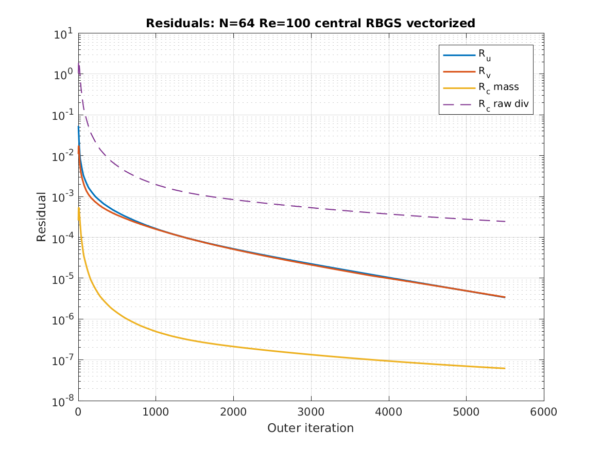

<p align="center">
  
</p>

<h1 align="center">🌀 Lid Cavity MATLAB</h1>

<p align="center">
  <b>MATLAB SIMPLE-style pressure-correction solver for the 2D incompressible lid-driven cavity benchmark</b>
</p>

<p align="center">
  <i>Loop and vectorized MATLAB implementations · Ghia benchmark validation · Mesh/Reynolds/scheme/solver comparison</i>
</p>

<p align="center">
  <a href="LICENSE">
    
  </a>
  
  
  
  
  
  
  
  
</p>

<p align="center">
  <a href="#overview">Overview</a> •
  <a href="#features">Features</a> •
  <a href="#numerical-method">Method</a> •
  <a href="#study-matrix">Study Matrix</a> •
  <a href="#validation">Validation</a> •
  <a href="#example-results">Results</a> •
  <a href="#how-to-run">Run</a>
</p>

---

# Lid Cavity MATLAB

A MATLAB CFD benchmark project for the two-dimensional incompressible lid-driven cavity problem using a SIMPLE-style pressure-correction solver.

This repository contains only the MATLAB implementation.

---

## Overview

This project solves the 2D incompressible Navier–Stokes equations for the classical lid-driven cavity benchmark.

The solver includes:

- full 2D incompressible momentum equations,
- pressure-correction / SIMPLE-style coupling,
- loop-based MATLAB implementation,
- vectorized MATLAB implementation,
- upwind and central convection schemes,
- red-black Gauss-Seidel pressure solver,
- red-black SOR pressure solver,
- mesh and Reynolds-number studies,
- validation against Ghia et al. benchmark data,
- automatic generation of plots and summary tables.

The purpose of the project is to understand CFD from the numerical-method level rather than relying only on black-box CFD software.

---

## Features

- MATLAB implementation of a 2D incompressible Navier–Stokes solver.
- SIMPLE-style pressure correction.
- Collocated structured Cartesian grid.
- Vectorized and loop-based solver comparison.
- Upwind and central differencing comparison.
- RBGS and RBSOR pressure solver comparison.
- Mesh study with `N = 32, 64, 128`.
- Reynolds-number study with `Re = 100, 400, 1000`.
- Ghia benchmark validation.
- Residual, velocity, pressure, streamline, vorticity, and validation plots.
- Automatic CSV summary export.

---

## Governing Equations

The continuity equation is:

```math
\nabla \cdot \mathbf{u} = 0
````

The incompressible Navier–Stokes equations are:

```math
\frac{\partial \mathbf{u}}{\partial t}
+
(\mathbf{u}\cdot\nabla)\mathbf{u}
=
-\nabla p
+
\frac{1}{Re}\nabla^2 \mathbf{u}
```

where:

* `u` and `v` are velocity components,
* `p` is pressure,
* `Re` is the Reynolds number.

The Reynolds number is defined as:

```math
Re = \frac{UL}{\nu}
```

where:

* `U` is the lid velocity,
* `L` is the cavity length,
* `ν` is the kinematic viscosity.

---

## SIMPLE-Style Pressure Correction

The solver uses a pressure-correction procedure:

1. Initialize velocity and pressure.
2. Apply lid-driven cavity boundary conditions.
3. Predict intermediate velocities from the momentum equations.
4. Solve the pressure correction Poisson equation.
5. Correct velocity using the pressure correction.
6. Update pressure with under-relaxation.
7. Compute residuals.
8. Repeat until convergence or maximum iteration count.

The pressure correction equation is:

```math
\nabla^2 p' =
\frac{1}{\Delta t}
\nabla \cdot \mathbf{u}^{*}
```

Velocity correction:

```math
\mathbf{u}^{n+1}
=
\mathbf{u}^{*}
-
\Delta t \nabla p'
```

Pressure update:

```math
p^{n+1}
=
p^n
+
\alpha_p p'
```

---

## Numerical Method

| Component                  | Method                                   |
| -------------------------- | ---------------------------------------- |
| Governing equations        | 2D incompressible Navier–Stokes          |
| Pressure–velocity coupling | SIMPLE-style pressure correction         |
| Grid                       | Collocated structured Cartesian grid     |
| Spatial discretization     | Finite difference                        |
| Time treatment             | Pseudo-time steady iteration             |
| Convection schemes         | Upwind and central differencing          |
| Diffusion terms            | Central differencing                     |
| Pressure equation          | Poisson equation                         |
| Pressure solvers           | Red-black Gauss-Seidel and red-black SOR |
| Boundary conditions        | Moving lid and no-slip walls             |
| Validation                 | Ghia et al. centerline benchmark data    |

---

## Study Matrix

The full study runs:

| Parameter          | Values               |
| ------------------ | -------------------- |
| Mesh sizes         | `32`, `64`, `128`    |
| Reynolds numbers   | `100`, `400`, `1000` |
| Convection schemes | `upwind`, `central`  |
| Pressure solvers   | `RBGS`, `RBSOR`      |
| Implementations    | `loop`, `vectorized` |

Total number of simulations:

```text
3 × 3 × 2 × 2 × 2 = 72 simulations
```

---

## Validation

The solver is validated against the benchmark centerline velocity data from:

> Ghia, U., Ghia, K. N., and Shin, C. T.
> “High-Re solutions for incompressible flow using the Navier-Stokes equations and a multigrid method.”
> Journal of Computational Physics, 48(3), 387–411, 1982.

The validation compares:

* vertical centerline velocity `u(y)` at `x = 0.5`,
* horizontal centerline velocity `v(x)` at `y = 0.5`.

Validation data is included for:

* `Re = 100`,
* `Re = 400`,
* `Re = 1000`.

---

## Example Results

### Residual History

<p align="center">
  
</p>

### Velocity Magnitude

<p align="center">
  
</p>

### Streamlines

<p align="center">
  
</p>

### Ghia Validation: u Centerline

<p align="center">
  
</p>

### Ghia Validation: v Centerline

<p align="center">
  
</p>

### Runtime Comparison

<p align="center">
  
</p>

### Pressure Solver Comparison

<p align="center">
  
</p>

### Mesh and Scheme Validation Error

<p align="center">
  
</p>

---

## Project Structure

```text
LidCavity_MATLAB/
│
├── README.md
├── LICENSE
├── .gitignore
│
├── main.m
├── main_quick.m
├── main_medium.m
├── default_config.m
│
├── run.sh
├── run_quick.sh
├── run_medium.sh
│
├── core/
│   ├── solve_lid_cavity.m
│   ├── momentum_predictor_vectorized.m
│   ├── momentum_predictor_loop.m
│   ├── pressure_poisson.m
│   ├── apply_lid_bc.m
│   ├── apply_pressure_bc.m
│   ├── divergence_field.m
│   ├── velocity_residuals.m
│   ├── compute_dt.m
│   └── compute_vorticity.m
│
├── studies/
│   ├── run_parametric_study.m
│   ├── run_single_case.m
│   └── run_best_validation_case.m
│
├── validation/
│   ├── ghia_data.m
│   └── validate_against_ghia.m
│
├── post/
│   ├── plot_fields.m
│   ├── plot_residuals.m
│   ├── plot_validation.m
│   ├── plot_study_summary.m
│   └── save_current_figure.m
│
├── docs/
├── assets/
│   ├── figures/
│   └── data/
│
└── results/
    ├── data/
    └── figures/
```

---

## Important Files

### Main Scripts

| File               | Purpose                     |
| ------------------ | --------------------------- |
| `main.m`           | Runs the full 72-case study |
| `main_quick.m`     | Runs a smaller quick study  |
| `main_medium.m`    | Runs an intermediate study  |
| `default_config.m` | Main configuration file     |

### Main Folders

| Folder        | Purpose                                                     |
| ------------- | ----------------------------------------------------------- |
| `core/`       | Solver, pressure correction, residuals, boundary conditions |
| `studies/`    | Study automation scripts                                    |
| `validation/` | Ghia benchmark validation                                   |
| `post/`       | Plotting and result export                                  |
| `assets/`     | Selected figures and summary data for GitHub                |
| `results/`    | Generated results, ignored by Git                           |

---

## How to Run

### Quick Run

```bash
chmod +x run_quick.sh
./run_quick.sh
```

or in MATLAB:

```matlab
main_quick
```

### Medium Run

```bash
chmod +x run_medium.sh
./run_medium.sh
```

or in MATLAB:

```matlab
main_medium
```

### Full Run

```bash
chmod +x run.sh
./run.sh
```

or in MATLAB:

```matlab
main
```

---

## Output

Generated output is saved in:

```text
results/data/
results/figures/
```
hia Validation: v 
Typical generated files include:

* `study_summary.csv`,
* residual plots,
* velocity magnitude contours,
* pressure contours,
* streamlines,
* vorticity plots,
* Ghia validation plots.

The full generated `results/` folder is not intended to be committed to GitHub.

Only selected figures are stored in:

```text
assets/figures/
```

---

## Summary Table Columns

The generated `study_summary.csv` contains:

| Column                 | Meaning                        |
| ---------------------- | ------------------------------ |
| `Implementation`       | Loop or vectorized             |
| `N`                    | Mesh size                      |
| `Re`                   | Reynolds number                |
| `Scheme`               | Upwind or central              |
| `PressureSolver`       | RBGS or RBSOR                  |
| `FinalRu`              | Final u-velocity residual      |
| `FinalRv`              | Final v-velocity residual      |
| `FinalRcMass`          | Normalized continuity residual |
| `FinalRcDiv`           | Raw divergence residual        |
| `Runtime_s`            | Runtime in seconds             |
| `AvgPoissonIterations` | Average pressure iterations    |
| `Ghia_u_L2`            | L2 error for u centerline      |
| `Ghia_v_L2`            | L2 error for v centerline      |
| `ValidationPass`       | Benchmark validation status    |

---

## Notes on MATLAB `.fig` Files

`.fig` files are MATLAB-native editable figures.

They are useful if you want to reopen a plot in MATLAB and edit:

* axes,
* labels,
* legends,
* colors,
* line widths,
* annotations.

They are not needed for GitHub and are ignored by `.gitignore`.

---

## Known Limitations

This is an educational and research-style MATLAB CFD solver.

Current limitations:

* The solver uses a collocated finite-difference formulation.
* It is not a commercial finite-volume CFD solver.
* Rhie–Chow interpolation is not implemented.
* Turbulence modeling is not included.
* High-Reynolds-number cases require sufficiently fine meshes.
* Coarse high-Reynolds-number cases can be under-resolved.
* The code prioritizes clarity and numerical comparison over maximum performance.

---

## Repository Hygiene

Generated files are ignored by `.gitignore`:

```text
*.mat
*.fig
results/data/*
results/figures/*
```

Only selected plots are included under:

```text
assets/figures/
```

---

## References

1. Ghia, U., Ghia, K. N., and Shin, C. T.
   High-Re solutions for incompressible flow using the Navier-Stokes equations and a multigrid method.
   Journal of Computational Physics, 48(3), 387–411, 1982.

2. Patankar, S. V.
   Numerical Heat Transfer and Fluid Flow.
   Hemisphere Publishing, 1980.

3. Ferziger, J. H., Peric, M., and Street, R. L.
   Computational Methods for Fluid Dynamics.
   Springer, 2002.

4. Versteeg, H. K., and Malalasekera, W.
   An Introduction to Computational Fluid Dynamics: The Finite Volume Method.
   Pearson, 2007.

---

## License

This project is licensed under the MIT License.

See `LICENSE` for details.

---

## Contact

Ahmed Kandil

* GitHub: [Kandil2001](https://github.com/Kandil2001)
* LinkedIn: [Ahmed Kandil](https://www.linkedin.com/in/ahmed-kandil01)
* Email: [a.akandil@outlook.com](mailto:a.akandil@outlook.com)
