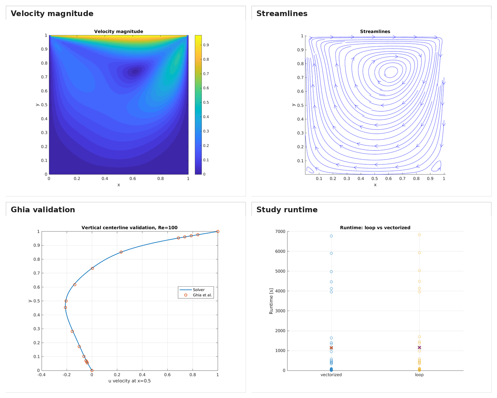
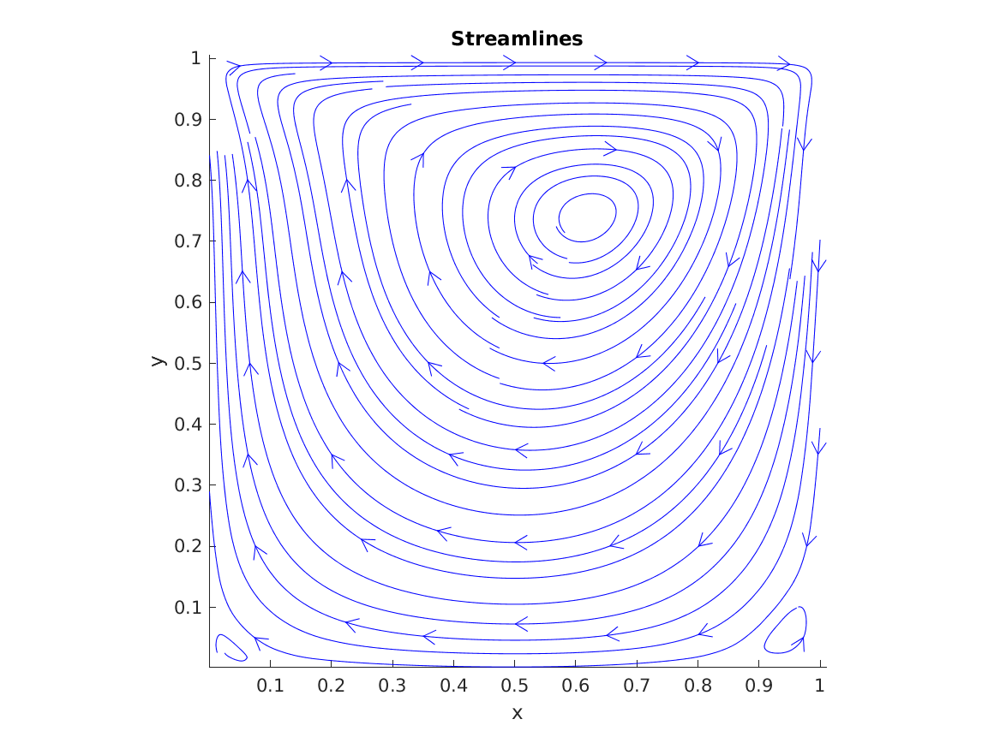
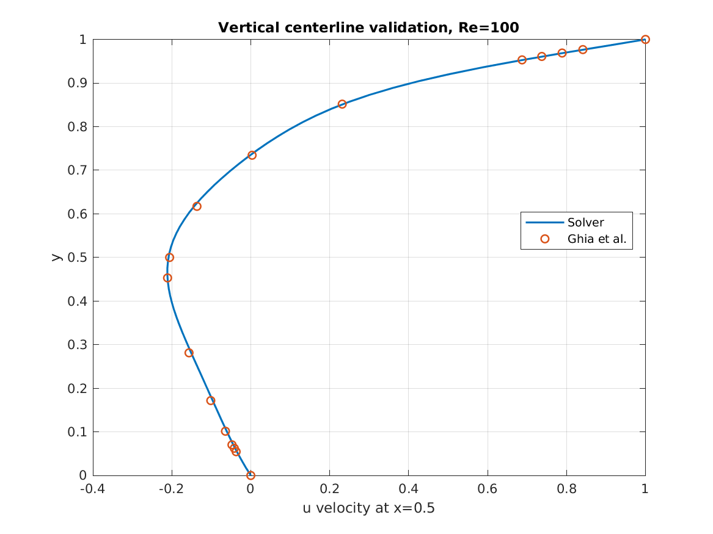
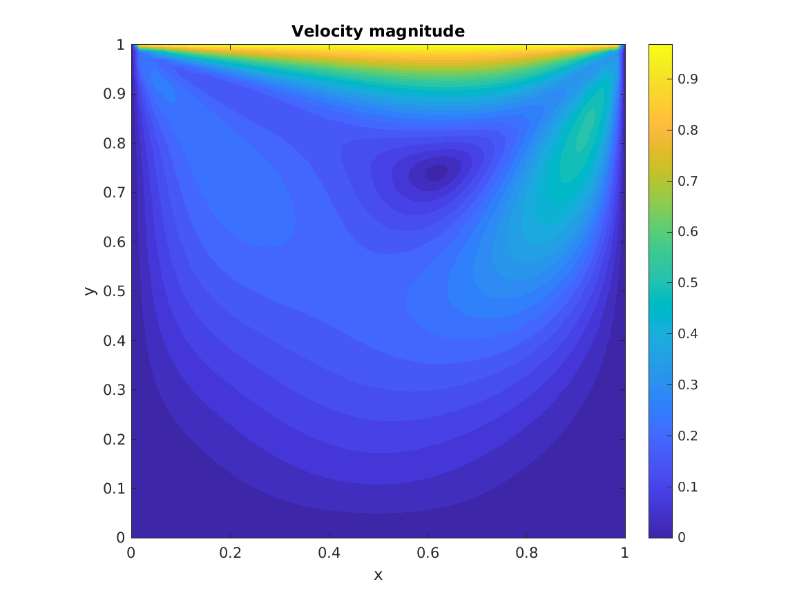
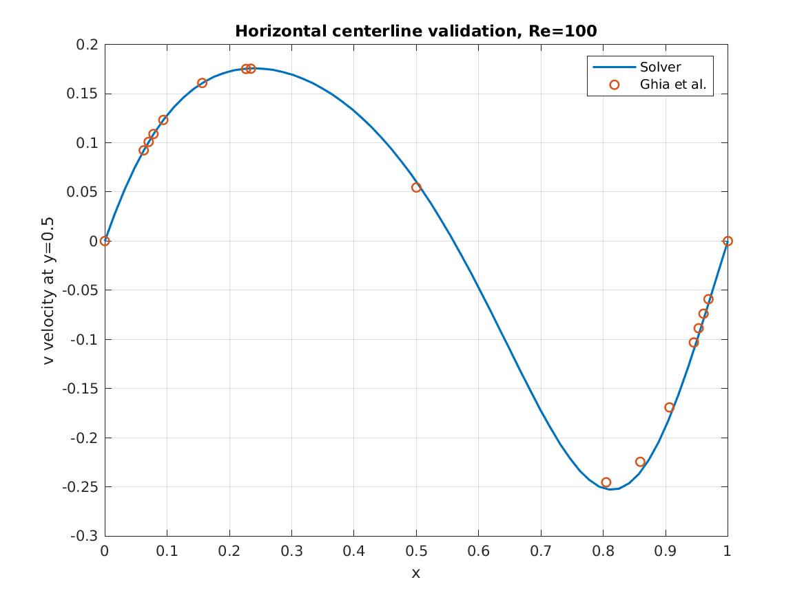

# Lid-Driven Cavity Flow Solver in MATLAB

[](https://www.mathworks.com/products/matlab.html)
[](LICENSE)
[](https://kandil2001.github.io)

I built this project to get closer to the numerical side of CFD instead of treating the solver as a black box. It solves the two-dimensional incompressible lid-driven cavity problem with a pressure-correction method and compares several implementation choices.

The repository includes a loop-based and a vectorized momentum predictor, upwind and central differencing, two pressure solvers, a mesh/Reynolds-number study, and validation against the centerline data published by Ghia et al.

<p align="center">
  
</p>

## What is included

- SIMPLE-style pressure-velocity coupling on a structured collocated grid
- Loop-based and vectorized MATLAB momentum predictors
- Upwind and central convection schemes
- Red-black Gauss-Seidel (`RBGS`) and red-black SOR (`RBSOR`) pressure solvers
- Meshes `N = 32, 64, 128`
- Reynolds numbers `Re = 100, 400, 1000`
- Centerline validation against Ghia et al.
- Automatic plots and a CSV summary for the full study

The full parameter study contains 72 cases:

```text
3 meshes × 3 Reynolds numbers × 2 schemes × 2 pressure solvers × 2 implementations
```

## A representative case

The figures below are from `N = 64`, `Re = 100`, central differencing, RBGS, and the vectorized momentum predictor.

| Flow field | Centerline validation |
|---|---|
|  |  |
|  |  |

## Numerical approach

The solver uses the non-dimensional incompressible Navier-Stokes equations:

```text
Continuity:         ∇ · u = 0
Momentum equation:  ∂u/∂t + (u · ∇)u = −∇p + (1/Re)∇²u
```

At each outer iteration, the code predicts a velocity field, solves a Poisson equation for the pressure correction, corrects the velocity, and checks the velocity and continuity residuals. More detail is available in [docs/METHODOLOGY.md](docs/METHODOLOGY.md).

## What I found

The full study completed and produced results for all 72 cases. A few points stood out:

- `44/72` cases met the selected Ghia centerline-error thresholds.
- All 72 cases reached their configured outer-iteration limit before meeting the strict convergence tolerances. I keep this visible in the summary rather than presenting the cases as fully converged.
- The finer `N = 128` mesh met the selected validation thresholds for all tested combinations, while coarse high-Reynolds-number cases showed the expected loss of accuracy.
- RBSOR reduced the average pressure-solver iterations substantially compared with RBGS and had the largest effect on total runtime.
- Vectorizing the momentum predictor alone gave only a small overall runtime improvement because the pressure solve remained the main cost.

These results use the thresholds defined in `default_config.m`; they should be read as a comparison within this study, not as proof of full validation.


A more detailed discussion is in [docs/RESULTS.md](docs/RESULTS.md).

## Running the code

Start from the repository root in MATLAB.

For a smaller check:

```matlab
main_quick
```

For the intermediate study:

```matlab
main_medium
```

For the full 72-case study:

```matlab
main
```

Linux shell wrappers are also included as `run_quick.sh`, `run_medium.sh`, and `run.sh`.

Generated files are written to:

```text
results/data/
results/figures/
```

The full study can take a long time, especially for the `N = 128` cases and the RBGS pressure solver. See [docs/RUNNING.md](docs/RUNNING.md) for the available run modes and common issues.

## Repository layout

```text
LidCavity_MATLAB/
├── core/          solver and numerical routines
├── studies/       single-case and parameter-study runners
├── validation/    Ghia data and error calculation
├── post/          plotting and result export
├── assets/        selected figures and the published study summary
├── docs/          methodology, validation, results, and run notes
├── results/       generated output; ignored by Git
├── default_config.m
├── main_quick.m
├── main_medium.m
└── main.m
```

## Current limitations

This is a learning and comparison solver, not an industrial CFD package. The current implementation uses a collocated grid without Rhie-Chow interpolation, has no multigrid pressure solver, and does not include turbulence modelling or adaptive mesh refinement. The strict stopping criteria also need more work, as shown by the cases reaching the iteration limit.

The next improvements I would make are a better pressure-velocity treatment, a faster pressure solver, and a clearer grid-independence study.

## Reference

Ghia, U., Ghia, K. N., & Shin, C. T. (1982). *High-Re solutions for incompressible flow using the Navier-Stokes equations and a multigrid method*. Journal of Computational Physics, 48(3), 387–411.

## Author

Ahmed Kandil — [Portfolio Website](https://kandil2001.github.io) · [GitHub](https://github.com/Kandil2001) · [LinkedIn](https://www.linkedin.com/in/ahmed-kandil03/)

Released under the [MIT License](LICENSE).
