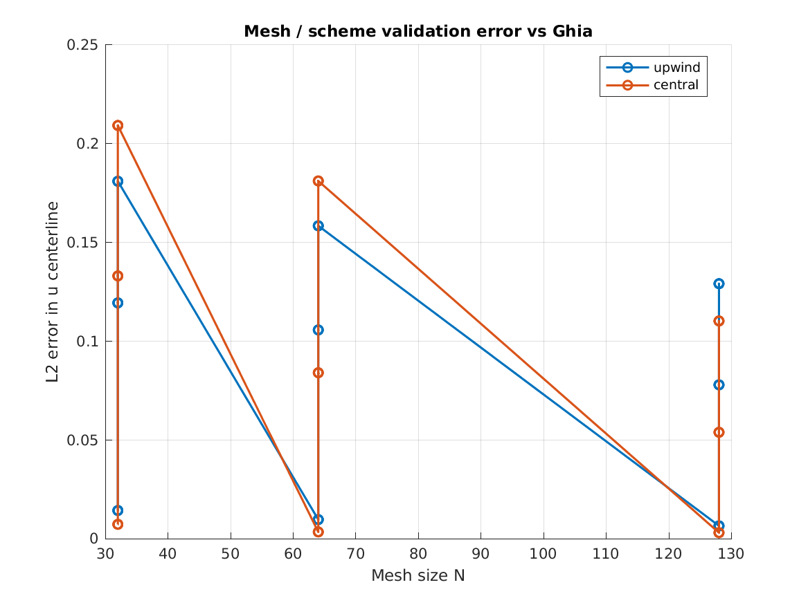
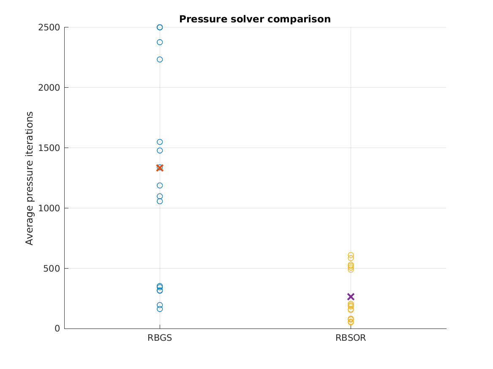
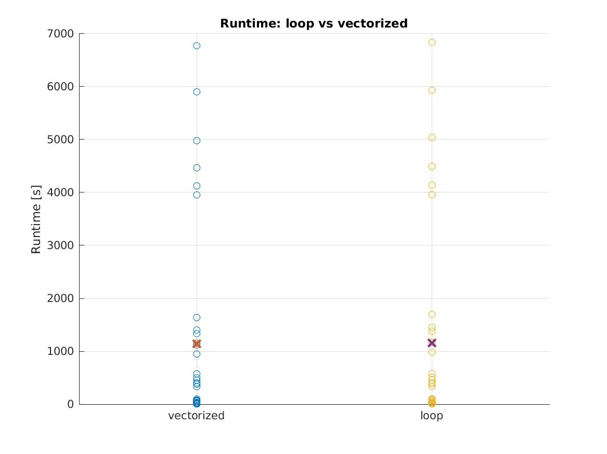

# Results and observations

The full parameter study contains 72 cases covering three meshes, three Reynolds numbers, two convection schemes, two pressure solvers, and two momentum-predictor implementations.

The summary used here is stored in [`assets/data/study_summary.csv`](../assets/data/study_summary.csv).

## Overall outcome

| Result | Value |
|---|---:|
| Cases completed | 72 |
| Cases meeting the selected Ghia error thresholds | 44 |
| Cases meeting the strict outer convergence criteria before `maxIter` | 0 |
| Validation passes at `N = 32` | 8 / 24 |
| Validation passes at `N = 64` | 12 / 24 |
| Validation passes at `N = 128` | 24 / 24 |

The most important caveat is that every case reached its configured outer-iteration limit. Some cases still matched the Ghia centerline data reasonably well, but I do not treat that as the same thing as full numerical convergence. The CSV therefore keeps the stopping status and the validation result as separate fields.

## Mesh and Reynolds-number effects

The validation trend was clear: finer meshes performed better, and higher Reynolds numbers were harder to resolve.

- All 24 cases at `Re = 100` met the selected centerline-error thresholds.
- At `Re = 400`, 12 of 24 cases passed.
- At `Re = 1000`, 8 of 24 cases passed.
- All 24 cases on the `N = 128` mesh passed the selected thresholds.

This does not prove grid independence, but it shows the expected direction of the mesh effect. The coarse-grid high-Reynolds-number cases are useful because they show how quickly numerical diffusion and under-resolution can affect the centerline profiles.

## Upwind and central differencing

Central differencing passed the selected validation threshold in 24 of 36 cases, compared with 20 of 36 for upwind. On the better-resolved cases, central differencing generally followed the benchmark more closely. Upwind was more forgiving on coarse cases, but its extra diffusion weakened the velocity gradients.

The result is the expected trade-off rather than a simple winner: upwind is useful for robustness, while central differencing benefits more from mesh refinement.

## Pressure-solver performance

The pressure solve dominated the computational cost. Across the study:

| Pressure solver | Mean pressure iterations per outer iteration | Mean total case runtime* |
|---|---:|---:|
| RBGS | about 1333 | about 1841 s |
| RBSOR | about 265 | about 458 s |

\*These times belong to the machine and configuration used to generate the included summary. They should only be used for comparison within this dataset.

RBSOR had a much larger effect on runtime than vectorizing the momentum predictor.

## Loop and vectorized implementations

Equivalent loop and vectorized cases produced matching numerical results. The mean total runtime was about `1157 s` for the loop cases and `1142 s` for the vectorized cases, so the overall speed difference was small.

That result was useful: it showed that improving one part of the code does not necessarily improve the full solver when another part, here the pressure Poisson solve, remains the bottleneck.

## What I would improve next

The study exposed several areas that deserve another iteration:

1. Revisit the outer stopping criteria and relaxation settings so that representative cases reach convergence without relying on very large iteration limits.
2. Improve the collocated pressure-velocity treatment, for example with Rhie-Chow-style interpolation.
3. Replace or accelerate the pressure solver, ideally with multigrid or a sparse linear-system approach.
4. Run a dedicated grid-independence study instead of using only pass/fail validation thresholds.
5. Compare vortex locations and strengths in addition to centerline velocities.

The current results are still useful as a transparent record of the solver's behaviour, including where it works well and where it needs improvement.
